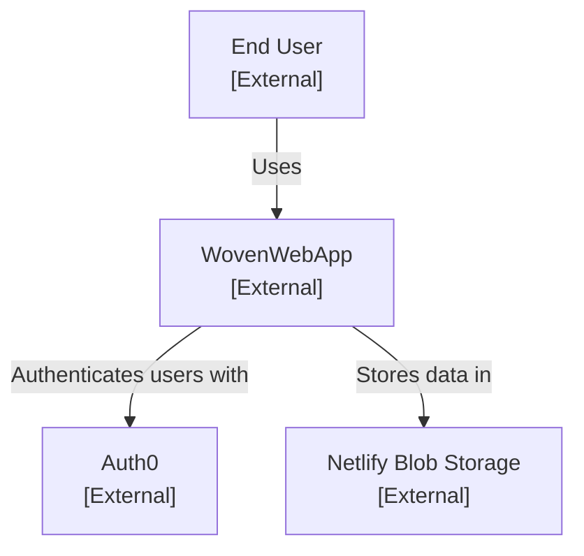
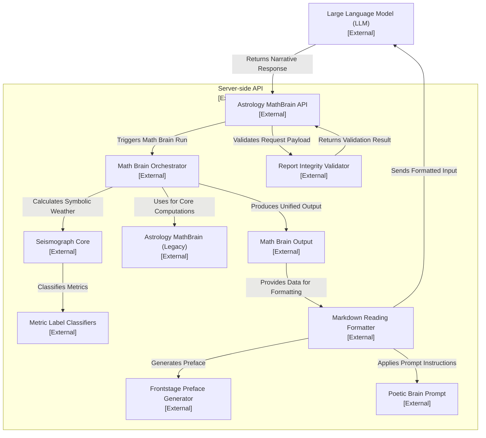
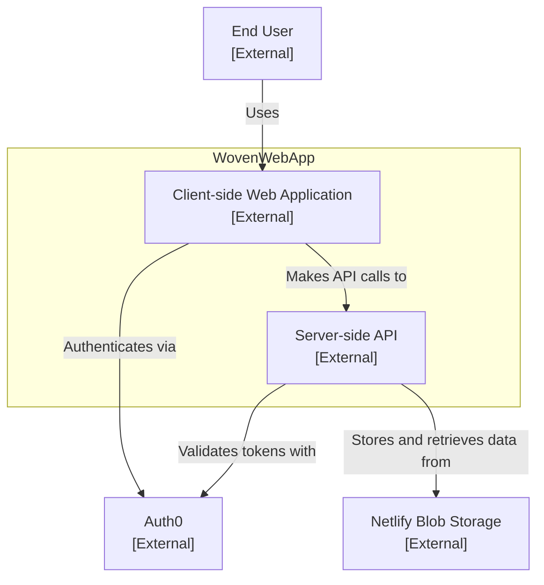

# Unnamed CodeViz Diagram

```mermaid
graph TD

    base.cv::end_user["End User<br>[External]"]
    base.cv::woven_webapp["WovenWebApp<br>[External]"]
    base.cv::auth0["Auth0<br>[External]"]
    base.cv::netlify_blobs["Netlify Blob Storage<br>[External]"]
    %% Edges at this level (grouped by source)
    base.cv::end_user["End User<br>[External]"] -->|"Uses"| base.cv::woven_webapp["WovenWebApp<br>[External]"]
    base.cv::woven_webapp["WovenWebApp<br>[External]"] -->|"Authenticates users with"| base.cv::auth0["Auth0<br>[External]"]
    base.cv::woven_webapp["WovenWebApp<br>[External]"] -->|"Stores data in"| base.cv::netlify_blobs["Netlify Blob Storage<br>[External]"]

```
# Unnamed CodeViz Diagram

```mermaid
graph TD

    math_poetic_brain_component.cv::large_language_model["Large Language Model (LLM)<br>[External]"]
    subgraph math_poetic_brain_component.cv::server_api["Server-side API<br>[External]"]
        math_poetic_brain_component.cv::astrology_mathbrain_api["Astrology MathBrain API<br>[External]"]
        math_poetic_brain_component.cv::mathbrain_orchestrator["Math Brain Orchestrator<br>[External]"]
        math_poetic_brain_component.cv::seismograph_core["Seismograph Core<br>[External]"]
        math_poetic_brain_component.cv::astrology_mathbrain_legacy["Astrology MathBrain (Legacy)<br>[External]"]
        math_poetic_brain_component.cv::metric_label_classifiers["Metric Label Classifiers<br>[External]"]
        math_poetic_brain_component.cv::mathbrain_output["Math Brain Output<br>[External]"]
        math_poetic_brain_component.cv::markdown_reading_formatter["Markdown Reading Formatter<br>[External]"]
        math_poetic_brain_component.cv::frontstage_preface_generator["Frontstage Preface Generator<br>[External]"]
        math_poetic_brain_component.cv::poetic_brain_prompt["Poetic Brain Prompt<br>[External]"]
        math_poetic_brain_component.cv::report_integrity_validator["Report Integrity Validator<br>[External]"]
        %% Edges at this level (grouped by source)
        math_poetic_brain_component.cv::astrology_mathbrain_api["Astrology MathBrain API<br>[External]"] -->|"Validates Request Payload"| math_poetic_brain_component.cv::report_integrity_validator["Report Integrity Validator<br>[External]"]
        math_poetic_brain_component.cv::astrology_mathbrain_api["Astrology MathBrain API<br>[External]"] -->|"Triggers Math Brain Run"| math_poetic_brain_component.cv::mathbrain_orchestrator["Math Brain Orchestrator<br>[External]"]
        math_poetic_brain_component.cv::report_integrity_validator["Report Integrity Validator<br>[External]"] -->|"Returns Validation Result"| math_poetic_brain_component.cv::astrology_mathbrain_api["Astrology MathBrain API<br>[External]"]
        math_poetic_brain_component.cv::mathbrain_orchestrator["Math Brain Orchestrator<br>[External]"] -->|"Uses for Core Computations"| math_poetic_brain_component.cv::astrology_mathbrain_legacy["Astrology MathBrain (Legacy)<br>[External]"]
        math_poetic_brain_component.cv::mathbrain_orchestrator["Math Brain Orchestrator<br>[External]"] -->|"Calculates Symbolic Weather"| math_poetic_brain_component.cv::seismograph_core["Seismograph Core<br>[External]"]
        math_poetic_brain_component.cv::mathbrain_orchestrator["Math Brain Orchestrator<br>[External]"] -->|"Produces Unified Output"| math_poetic_brain_component.cv::mathbrain_output["Math Brain Output<br>[External]"]
        math_poetic_brain_component.cv::seismograph_core["Seismograph Core<br>[External]"] -->|"Classifies Metrics"| math_poetic_brain_component.cv::metric_label_classifiers["Metric Label Classifiers<br>[External]"]
        math_poetic_brain_component.cv::mathbrain_output["Math Brain Output<br>[External]"] -->|"Provides Data for Formatting"| math_poetic_brain_component.cv::markdown_reading_formatter["Markdown Reading Formatter<br>[External]"]
        math_poetic_brain_component.cv::markdown_reading_formatter["Markdown Reading Formatter<br>[External]"] -->|"Generates Preface"| math_poetic_brain_component.cv::frontstage_preface_generator["Frontstage Preface Generator<br>[External]"]
        math_poetic_brain_component.cv::markdown_reading_formatter["Markdown Reading Formatter<br>[External]"] -->|"Applies Prompt Instructions"| math_poetic_brain_component.cv::poetic_brain_prompt["Poetic Brain Prompt<br>[External]"]
    end
    %% Edges at this level (grouped by source)
    math_poetic_brain_component.cv::markdown_reading_formatter["Markdown Reading Formatter<br>[External]"] -->|"Sends Formatted Input"| math_poetic_brain_component.cv::large_language_model["Large Language Model (LLM)<br>[External]"]
    math_poetic_brain_component.cv::large_language_model["Large Language Model (LLM)<br>[External]"] -->|"Returns Narrative Response"| math_poetic_brain_component.cv::astrology_mathbrain_api["Astrology MathBrain API<br>[External]"]

```
# Unnamed CodeViz Diagram

```mermaid
graph TD

    woven_webapp_container.cv::end_user["End User<br>[External]"]
    woven_webapp_container.cv::auth0["Auth0<br>[External]"]
    woven_webapp_container.cv::netlify_blobs["Netlify Blob Storage<br>[External]"]
    subgraph woven_webapp_container.cv::woven_webapp["WovenWebApp<br>[External]"]
        woven_webapp_container.cv::client_webapp["Client-side Web Application<br>[External]"]
        woven_webapp_container.cv::server_api["Server-side API<br>[External]"]
        %% Edges at this level (grouped by source)
        woven_webapp_container.cv::client_webapp["Client-side Web Application<br>[External]"] -->|"Makes API calls to"| woven_webapp_container.cv::server_api["Server-side API<br>[External]"]
    end
    %% Edges at this level (grouped by source)
    woven_webapp_container.cv::end_user["End User<br>[External]"] -->|"Uses"| woven_webapp_container.cv::client_webapp["Client-side Web Application<br>[External]"]
    woven_webapp_container.cv::client_webapp["Client-side Web Application<br>[External]"] -->|"Authenticates via"| woven_webapp_container.cv::auth0["Auth0<br>[External]"]
    woven_webapp_container.cv::server_api["Server-side API<br>[External]"] -->|"Validates tokens with"| woven_webapp_container.cv::auth0["Auth0<br>[External]"]
    woven_webapp_container.cv::server_api["Server-side API<br>[External]"] -->|"Stores and retrieves data from"| woven_webapp_container.cv::netlify_blobs["Netlify Blob Storage<br>[External]"]

```
---
*Generated by [CodeViz.ai](https://codeviz.ai) on 11/28/2025, 4:42:53 PM*
